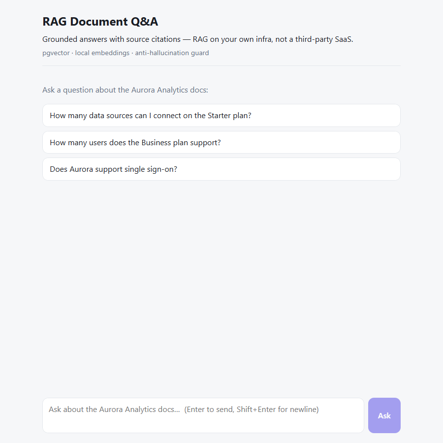
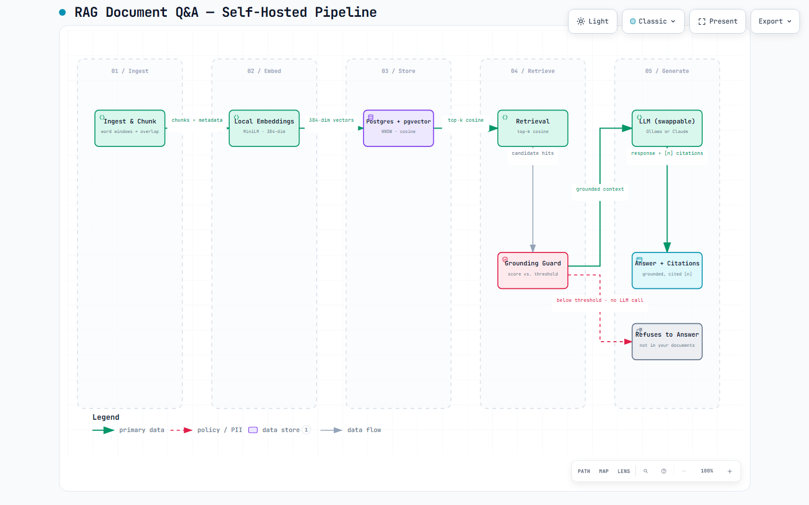

# RAG Document Q&A — "Chat With Your Docs"

Ask questions in natural language and get answers grounded in **your own documents**, with a
citation to the source for every answer — running entirely on **your own infrastructure**.

No Pinecone, no Weaviate, no paid embedding API. The vector store is Postgres (`pgvector`),
embeddings are computed by a local model, and the LLM is **swappable**: this demo runs it
**100% locally** with [Ollama](https://ollama.com), and it can be pointed at Claude in production
without touching the pipeline. Retrieval and embeddings are always free and self-hosted — the only
step that can be billed is answer generation, and only if you opt into a hosted model.



> The demo above runs on a local model via Ollama, so the model badge shows the local model id.
> Set `LLM_PROVIDER=anthropic` to generate with Claude instead — same code, same citations.

## Architecture

<picture>
  <source media="(prefers-color-scheme: dark)" srcset="assets/architecture-dark.png">
  
</picture>

```
PDF / markdown
   → chunking (word windows with overlap, keeps source + page)
   → local embeddings (sentence-transformers, 384-dim, self-hosted)
   → Postgres + pgvector (HNSW index)         ← vector store, your DB
   → retrieval (top-k, cosine similarity)
   → guard: score below threshold ⇒ "not in your documents" (no LLM call)
   → LLM (swappable: local via Ollama, or Claude) → answer + citations
```

- **Backend:** FastAPI (Python)
- **Vector store:** Postgres + `pgvector`, HNSW index (`vector_cosine_ops`)
- **Embeddings:** `all-MiniLM-L6-v2`, local, 384-dim — no external API, no per-token cost
- **Generation:** swappable — runs 100% local via Ollama (what this demo uses), or Claude
  Haiku 4.5 / Sonnet 5 in production (long/complex questions escalate to the stronger model)
- **UI:** a single-view React/Vite chat — clickable `[n]` citations that highlight their source
  card (title, page, similarity score, snippet), a distinct *outside-corpus* state when the guard
  refuses, and a badge showing which model answered

## Why this is different

Most RAG demos are a Colab notebook wired to Pinecone + a hosted embedding API. This one runs in
**your** stack: your Postgres holds the vectors, embeddings never leave the box, and generation is
swappable — you can run the whole thing offline with a local model, or plug in Claude for
production quality. The grounding guard refuses to answer when the documents don't cover the
question instead of hallucinating, and every answer cites the source chunk it came from.

## Cost model

| Step | Where it runs | Cost |
|---|---|---|
| Embeddings (ingest + query) | local model | $0 per token |
| Vector search | your Postgres | infra only |
| Answer generation — local | Ollama on your box | $0 per token |
| Answer generation — hosted | Claude Haiku 4.5 / Sonnet 5 | $1/$5 · $2/$10 per Mtok (in/out) |

Run it fully local for $0, or opt into Claude only for the generation step — retrieval and
embeddings stay free and self-hosted either way. When hosted, the cheap model handles the bulk and
the stronger one is used only for long or complex questions.

## Run it

Requires Docker.

```bash
cp .env.example .env      # optional: put your ANTHROPIC_API_KEY here for the Claude path
docker compose up --build # starts Postgres (pgvector) + the API + the chat UI

# ingest the sample corpus (fictional "Aurora Analytics" docs)
curl -X POST localhost:8000/ingest
```

Then open the chat UI at **http://localhost:5173** and ask away, or hit the API directly:

```bash
# ask a question grounded in the docs
curl -X POST localhost:8000/ask -H 'content-type: application/json' \
  -d '{"question": "How many data sources can I connect on the Starter plan?"}'

# ask something not in the docs → the guard refuses instead of inventing
curl -X POST localhost:8000/ask -H 'content-type: application/json' \
  -d '{"question": "What is the capital of France?"}'
```

**Local vs. hosted generation.** By default the API uses `LLM_PROVIDER=anthropic` and needs
`ANTHROPIC_API_KEY`. To run the whole thing offline with a local model (what the demo shows),
start with `LLM_PROVIDER=ollama` and an [Ollama](https://ollama.com) server on the host:

```bash
LLM_PROVIDER=ollama docker compose up --build   # no API key needed
```

Interactive API docs at `http://localhost:8000/docs`.

## Tests

Pure-logic checks (no DB, no API key needed):

```bash
cd api
pip install pytest
python -m pytest
```

Covers the chunker (overlap + metadata preserved) and the guard (refuses when the corpus
doesn't cover the question, before any LLM call).
